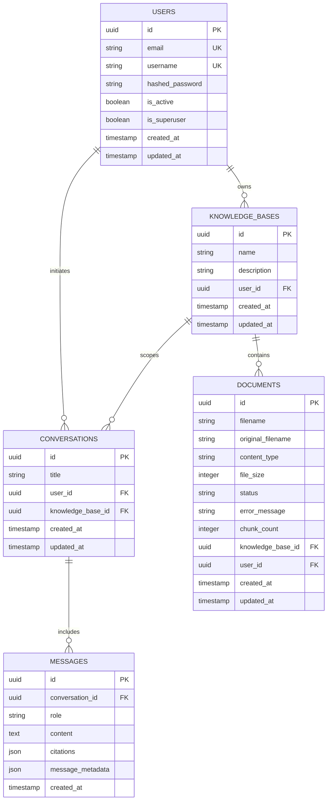

# Advanced Enterprise AI Knowledge Assistant — Architecture Specification

## 1. System Overview & Topology

The **Advanced Enterprise AI Knowledge Assistant** is a production-grade, multi-tenant Retrieval-Augmented Generation (RAG) platform designed to provide accurate, grounded answers from custom document knowledge bases.

```text
                    ┌────────────────────────────────────────────────────────┐
                    │                   Streamlit Frontend                   │
                    │      (Auth, KB Management, Doc Upload, Chat & Citations)│
                    └───────────────────────────┬────────────────────────────┘
                                                │ REST API (JSON / Multipart)
                                                ▼
                    ┌────────────────────────────────────────────────────────┐
                    │                   FastAPI Backend                      │
                    │   (JWT Auth, Dependency Injection, Validation, Router) │
                    └───────┬───────────────────┬────────────────────┬───────┘
                            │                   │                    │
           ┌────────────────▼────────┐ ┌────────▼─────────┐ ┌────────▼────────┐
           │   PostgreSQL Metadata   │ │   Qdrant Vector  │ │  Groq LLM Engine│
           │  (Users, KBs, Docs,     │ │ (Dense Embeddings│ │(Llama 3.3 70B   │
           │   Conversations, Msgs)  │ │ + Sparse Vectors)│ │ Query Rewrite,  │
           └─────────────────────────┘ └──────────────────┘ │ HyDE, Answers) │
                                                            └─────────────────┘
```

---

## 2. Core Technical Decisions & Rationale

### 2.1 LLM Service: Groq API
- **Selected Model:** `llama-3.3-70b-versatile` (configurable to `llama-3.1-8b-instant` for ultra-fast query routing).
- **Rationale:** Groq LPU inference provides ultra-low latency (<500ms time-to-first-token), enabling multi-stage RAG operations (Routing -> Rewrite/HyDE -> CRAG Evaluation -> Generation) to complete within interactive web latency budgets (< 2.5s total).
- **Centralized Design:** All LLM interactions are encapsulated behind a single `LLMService` interface with structured schemas and retry logic.

### 2.2 Dense Embedding Model: BAAI/bge-small-en-v1.5
- **Dimensionality:** 384 dimensions.
- **Rationale:** High ranking on the MTEB (Massive Text Embedding Benchmark) leaderboard while maintaining a small memory footprint (~130MB) and fast CPU/GPU inference. Optimized for asymmetric semantic retrieval (Query-to-Passage).

### 2.3 Sparse Search: FastEmbed BM25 / Qdrant Sparse Vectors
- **Rationale:** Handles exact-match retrieval for technical codes, model identifiers, product names, acronyms, and specific lexical terms that dense embeddings frequently miss.

### 2.4 Vector Database: Qdrant
- **Rationale:** High-performance, native support for multi-vector namespaces (dense + sparse), rich payload filtering for multi-tenancy (`user_id`, `knowledge_base_id`), and built-in Reciprocal Rank Fusion (RRF) support.

### 2.5 Relational Database: PostgreSQL with SQLAlchemy 2.0 & Alembic
- **Rationale:** Strong ACID transactional integrity, relational foreign key constraints, robust JSONB support for message citations and metadata, and industry-standard Alembic database migration management.

### 2.6 Reranker: Cross-Encoder (ms-marco-MiniLM-L-6-v2)
- **Rationale:** Lightweight (~80MB), fast cross-attention scoring between query and retrieved candidate chunks, significantly elevating precision at Top-$K$.

---

## 3. Data Isolation & Security Architecture

### 3.1 Multi-Tenant Data Isolation
Data isolation is strictly enforced across every layer:
1. **Relational Database Layer:**
   - Every database table (`knowledge_bases`, `documents`, `conversations`) maintains a foreign key `user_id`.
   - All queries filter by `user_id == current_user.id`.
2. **Vector Database Layer (Qdrant):**
   - Every stored vector payload includes `user_id`, `knowledge_base_id`, and `document_id`.
   - Every retrieval query strictly enforces `must` filter conditions:
     ```python
     Filter(must=[
         FieldCondition(key="user_id", match=MatchValue(value=current_user.id)),
         FieldCondition(key="knowledge_base_id", match=MatchValue(value=active_kb_id))
     ])
     ```
3. **File Storage Layer:**
   - Files are stored in isolated per-user directories: `uploads/{user_id}/{knowledge_base_id}/{document_id}_{filename}`.

### 3.2 Authentication & Security
- Passwords are encrypted using **bcrypt**.
- Authentication uses **JWT tokens** (HS256) with configurable expiration (`ACCESS_TOKEN_EXPIRE_MINUTES`).
- Sensitive values (API keys, DB credentials, secrets) are exclusively managed via `.env` and injected via Pydantic `BaseSettings`.

---

## 4. Document Ingestion Lifecycle

```text
[User Uploads File (PDF, DOCX, TXT)]
                  │
                  ▼
         [Validate Format & Size] ──(Invalid)──► [Return 400 Bad Request]
                  │ (Valid)
                  ▼
         [Save to User Storage]
                  │
                  ▼
      [Create DB Record: status = 'processing']
                  │
                  ▼
         [Extract Text by Page/Section]
                  │
                  ▼
       [Clean & Normalize Text]
                  │
                  ▼
   [Recursive Chunking (Chunk Size: 800, Overlap: 150)]
                  │
                  ▼
  [Generate Metadata (Doc ID, Page, Chunk ID)]
                  │
                  ▼
  [Generate Dense Embeddings + Sparse Representations]
                  │
                  ▼
    [Upsert Vectors & Payloads into Qdrant]
                  │
                  ▼
      [Update DB Record: status = 'ready']
```

---

## 5. Query & Advanced RAG Lifecycle

```text
                           [User Query + Active KB ID]
                                        │
                                        ▼
                           [Load Conversation History]
                                        │
                                        ▼
                              [Query Router (LLM)]
                                        │
            ┌───────────────────────────┼──────────────────────────┐
            ▼                           ▼                          ▼
     [Direct QA]                [Query Rewriting]                [HyDE]
  (Clean standalone query)     (Resolve coreferences)    (Hypothetical passage)
            │                           │                          │
            └───────────────────────────┼──────────────────────────┘
                                        │
                                        ▼
                                 [Hybrid Search]
                                        │
                         ┌──────────────┴──────────────┐
                         ▼                             ▼
                  [Dense Search]                [Sparse Search]
                  (Qdrant Dense)                 (BM25 / Sparse)
                         │                             │
                         └──────────────┬──────────────┘
                                        ▼
                         [Reciprocal Rank Fusion (RRF)]
                                        │ (Candidate Chunks: Top 20)
                                        ▼
                       [Cross-Encoder Reranker]
                                        │ (Top Relevant Chunks: Top 6-8)
                                        ▼
                       [Corrective RAG (CRAG) Evaluator]
                                        │
                        ┌───────────────┴───────────────┐
                        ▼                               ▼
                 [Context Good]                 [Context Poor / Empty]
                        │                               │
                        │                       [Attempt Query Revision]
                        │                               │ (Retry < MAX_ATTEMPTS)
                        │                               ▼
                        │                      [Hybrid Search Retry]
                        │                               │
                        │                       ┌───────┴───────┐
                        │                       ▼               ▼
                        │                  (Still Poor)      (Now Good)
                        │                       │               │
                        │                       ▼               │
                        │           [Grounded Insufficient      │
                        │            Context Notification]      │
                        │                       │               │
                        └───────────────────────┬───────────────┘
                                                ▼
                                    [Context Builder]
                                                │
                                                ▼
                                    [Groq Answer Generator]
                                  (Strict grounding prompt)
                                                │
                                                ▼
                                  [Parse Answers & Citations]
                                                │
                                                ▼
                                 [Persist Message & Return JSON]
```

---

## 6. Database Schema & Entities



---

## 7. REST API Endpoints Specification

### 7.1 Authentication & User Routes (`/api/v1/auth`, `/api/v1/users`)
- `POST /api/v1/auth/register` — Register new user.
- `POST /api/v1/auth/login` — Login and receive JWT access token.
- `GET  /api/v1/users/me` — Retrieve current authenticated user profile.

### 7.2 Knowledge Base Routes (`/api/v1/knowledge-bases`)
- `POST   /api/v1/knowledge-bases/` — Create new knowledge base.
- `GET    /api/v1/knowledge-bases/` — List user's knowledge bases.
- `GET    /api/v1/knowledge-bases/{kb_id}` — Get knowledge base details.
- `PUT    /api/v1/knowledge-bases/{kb_id}` — Update knowledge base.
- `DELETE /api/v1/knowledge-bases/{kb_id}` — Delete knowledge base (cascading doc & vector cleanup).

### 7.3 Document Routes (`/api/v1/documents`)
- `POST   /api/v1/documents/upload` — Multipart upload of documents to a knowledge base.
- `GET    /api/v1/documents/kb/{kb_id}` — List documents in a knowledge base.
- `GET    /api/v1/documents/{doc_id}` — Get document ingestion status.
- `DELETE /api/v1/documents/{doc_id}` — Delete document and remove vector representations from Qdrant.

### 7.4 Chat & Conversation Routes (`/api/v1/chat`)
- `POST   /api/v1/chat/conversations` — Create a conversation thread in a KB.
- `GET    /api/v1/chat/conversations?kb_id={kb_id}` — List conversations for a KB.
- `GET    /api/v1/chat/conversations/{conv_id}/messages` — Get messages for a conversation.
- `POST   /api/v1/chat/message` — Send message, run Advanced RAG pipeline, return answer + citations.
- `DELETE /api/v1/chat/conversations/{conv_id}` — Delete conversation thread.

---

## 8. Directory & Folder Structure

```text
enterprise-ai-knowledge-assistant/
│
├── backend/
│   ├── app/
│   │   ├── api/
│   │   │   ├── v1/
│   │   │   │   ├── endpoints/
│   │   │   │   │   ├── auth.py
│   │   │   │   │   ├── users.py
│   │   │   │   │   ├── knowledge_bases.py
│   │   │   │   │   ├── documents.py
│   │   │   │   │   └── chat.py
│   │   │   │   └── router.py
│   │   │   └── deps.py
│   │   ├── core/
│   │   │   ├── config.py
│   │   │   ├── logging.py
│   │   │   └── security.py
│   │   ├── db/
│   │   │   ├── base.py
│   │   │   └── session.py
│   │   ├── models/
│   │   │   ├── user.py
│   │   │   ├── knowledge_base.py
│   │   │   ├── document.py
│   │   │   ├── conversation.py
│   │   │   └── message.py
│   │   ├── schemas/
│   │   │   ├── auth.py
│   │   │   ├── user.py
│   │   │   ├── knowledge_base.py
│   │   │   ├── document.py
│   │   │   └── chat.py
│   │   ├── services/
│   │   │   ├── auth_service.py
│   │   │   ├── kb_service.py
│   │   │   ├── document_service.py
│   │   │   ├── llm_service.py
│   │   │   └── vector_service.py
│   │   ├── rag/
│   │   │   ├── parser.py
│   │   │   ├── chunker.py
│   │   │   ├── embeddings.py
│   │   │   ├── sparse.py
│   │   │   ├── hybrid_search.py
│   │   │   ├── reranker.py
│   │   │   ├── router.py
│   │   │   ├── rewriter.py
│   │   │   ├── hyde.py
│   │   │   ├── corrective.py
│   │   │   ├── generator.py
│   │   │   └── pipeline.py
│   │   ├── utils/
│   │   │   └── helpers.py
│   │   └── main.py
│   │
│   ├── tests/
│   │   ├── conftest.py
│   │   ├── test_auth.py
│   │   ├── test_kb.py
│   │   ├── test_documents.py
│   │   ├── test_rag_pipeline.py
│   │   └── test_chat.py
│   ├── alembic/
│   ├── alembic.ini
│   ├── requirements.txt
│   └── Dockerfile
│
├── frontend/
│   ├── pages/
│   │   ├── 1_📚_Knowledge_Bases.py
│   │   ├── 2_📄_Documents.py
│   │   └── 3_💬_Chat.py
│   ├── components/
│   │   ├── auth.py
│   │   ├── citations.py
│   │   └── sidebar.py
│   ├── services/
│   │   └── api_client.py
│   ├── app.py
│   ├── requirements.txt
│   └── Dockerfile
│
├── docker-compose.yml
├── .env.example
├── .gitignore
├── README.md
├── ARCHITECTURE.md
└── PROJECT_STATE.md
```
